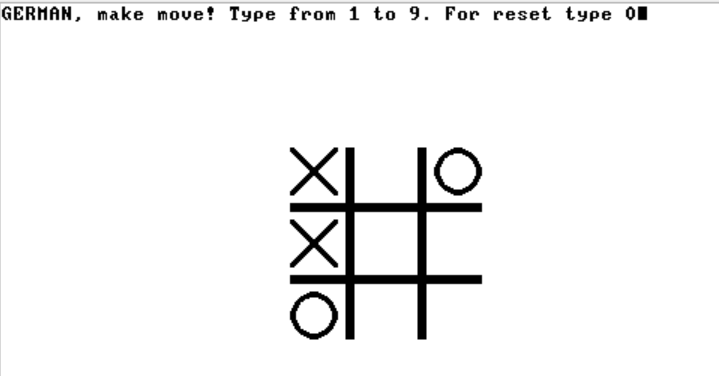
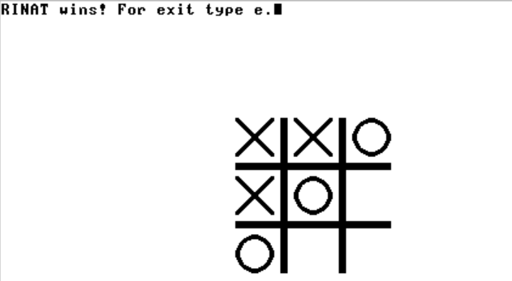

# Крестики-Нолики (Tic-Tac-Toe)

Не можешь выиграть в шахматы? Попробуй крестики-нолики, здесь будет быстрее!
Простая и увлекательная игра в **Крестики-Нолики** (или **Tic-Tac-Toe**), выполненная на Jack. Играй с другом и определи, кто круче

## Описание игры

Крестики-Нолики — это классическая настольная игра для двух игроков. Игра проходит на поле 3x3, где игроки по очереди ставят свои знаки — крестики (X) или нолики (O) — на пустые клетки поля, нажимая на цифры от 1 до 9. Побеждает тот, кто первым выстроит три одинаковых знака по вертикали, горизонтали или диагонали. 

## Особенности

- Простой и интуитивно понятный интерфейс на Jack.
- Ничего лишнего
- Поддержка игры на одном устройстве

## Установка

1. Клонируйте этот репозиторий:

   ```bash
   git clone https://github.com/MarkovGerman/Tic-Tac-Toe
   ```
2. Зайди в VM Emulator и открой папку Tic-Tac-Toe/vm
3. В поле **Animate** выбери **No animation**
4. Нажми **Run**
5. Кинь вызов другу - будь готов к настоящей войне

## Геймплэй
### Играй


### Побеждай

